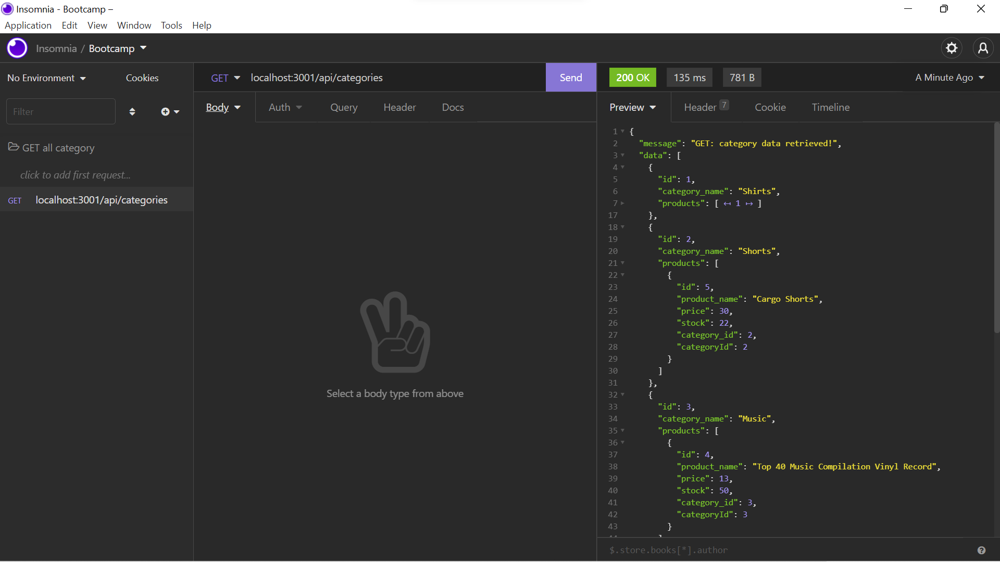

# ORM E-Commerce

 

- [Description](#description)
- [Installations](#installations)
- [Screenshot](#screenshot)
- [Video](#video)
- [Lincense](#license)
- [Contributing](#contributing)
- [Questions](#questions)

## Description

This project uses the latest technologies, Express and Sequelize, to interact with a MySQL database and build the back end of an e-commerce website so that a company can compete with others. Sensitive information are kept hidden through dotenv. Users are able to retrieve, add, update and delete data with the provided database and seeded data.

## Installations

npm install

## Screenshot

## Video

Click [here](https://drive.google.com/file/d/1TpdvNxMqIEkqDr5_Q-SQ-Mj2dgTZjfJd/view?usp=sharing)!

## License

 
Copyright © 2021 [Betty Chen](https://github.com/bchen41).  
This project is [MIT](https://github.com/bchen41/Note-Taker/blob/main/LICENSE) licensed.

## Contributing

All are welcomed to contribute as long as the standard industry guidelines are being followed.
Click [here](https://www.contributor-covenant.org/) for industry standard guidelines.

## Questions

For additional questions, contact me by reaching me at my [email](mailto:bettychen41@outlook.com).

You can find my other projects at my [GitHub](https://github.com/bchen41) profile.

Author: Betty Chen
